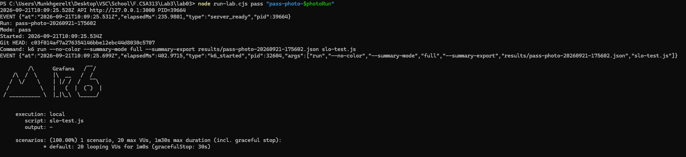
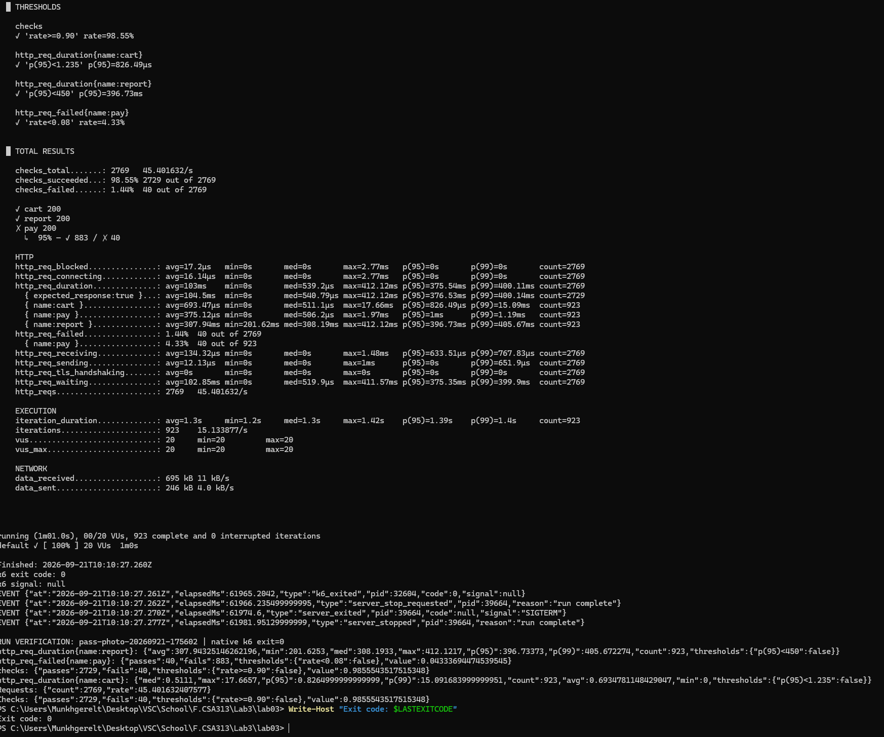
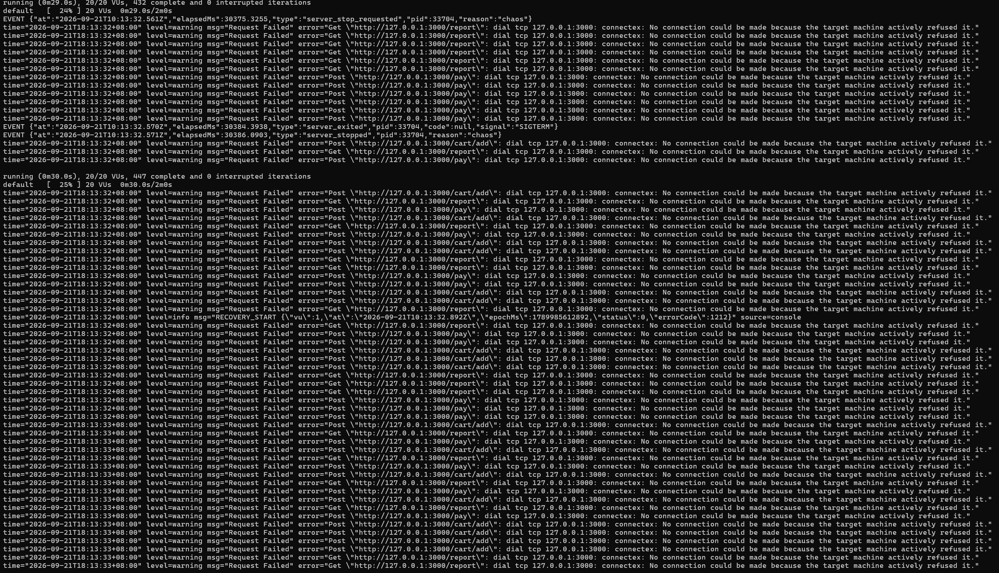
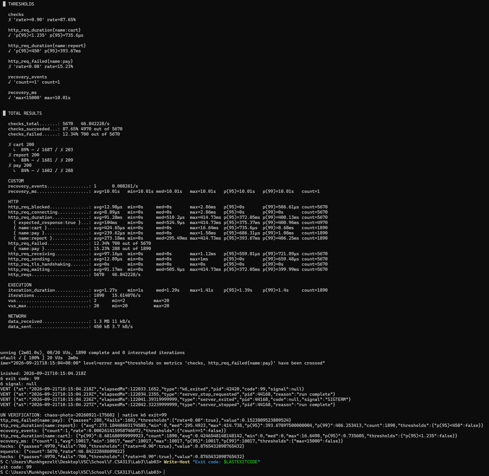
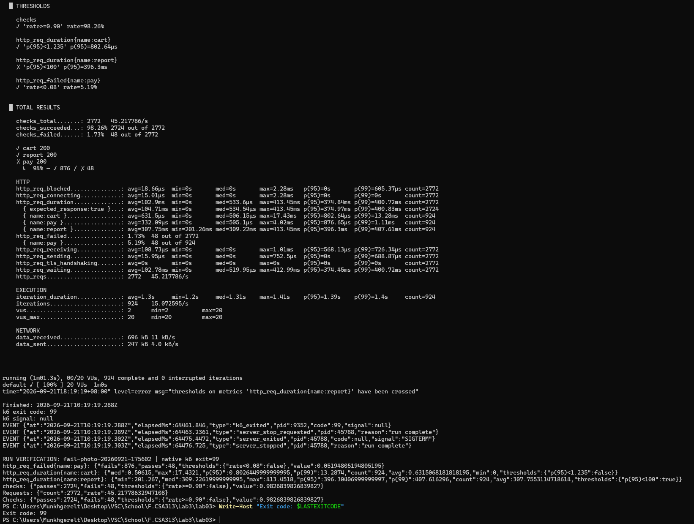

# Лаборатори №3 — Чанарын сценарио → SLO → k6 threshold

**Оюутны нэр:** М.Мөнхгэрэлт  
**Оюутны код:** B232270012  
**k6 version:** `k6.exe v2.2.0 (commit/00a9a1b7f5, go1.26.5, windows/amd64)`

## Ажлын нөхцөл ба суурь хэмжилт

F.CSA313 хичээлийн Лаб 3. Windows дээр зөвхөн `http://127.0.0.1:3000` рүү ачаалал өгнө.
Express API-ийн `/cart/add` шууд JSON буцаана; `/report` 200–400 мс санамсаргүй хүлээнэ; `/pay` хүсэлтийн ойролцоогоор 5%-д HTTP 500 буцаана.
Эдгээр нь тохируулсан зан төлөв болохоос хэмжсэн үр дүн биш.

Суурь тест: 20 тогтмол VU, 1 минут; cart→report→pay дараалал, давталт бүрийн төгсгөлд `sleep(1)`.
Нийт 2769 хүсэлт, 45.182395 хүсэлт/с; cart p95=0.823110 мс, p99=14.786700 мс; report p95=397.388270 мс, p99=406.741318 мс.
Хүсэлтийн хурд нь хэмжсэн утга; тогтмол VU нь тогтмол RPS батлахгүй.
Эх сурвалж: [бүтэн baseline гаралт](results/baseline.txt), [нарийвчилсан JSON](results/baseline.json).

## Чанарын дөрвөн сценарио

### 1. Гүйцэтгэл — сагсанд нэмэх

| Хэсэг | Тайлбар |
|---|---|
| Тойм | Хэрэглэгч сагсанд бараа нэмэхэд хурдан хариу авах. |
| Системийн төлөв | Локал API хэвийн ажиллаж байна. |
| Орчны төлөв | Windows; 20 тогтмол VU; 1 минут; baseline-д нийт 45.182395 хүсэлт/с хэмжигдсэн. |
| Гадаад өдөөлт | Хэрэглэгч POST /cart/add хүсэлт илгээх. |
| Шаардлагатай хариу | HTTP 200, `{ ok: true, items: 1 }`. |
| Хэмжүүр | Cart latency p95 < 1.235 мс; p99-ийг мөн тайлагнана, тусдаа p99 босго тогтоогоогүй. |

### 2. Найдвартай байдал — төлбөр

| Хэсэг | Тайлбар |
|---|---|
| Тойм | Хэвийн төлбөрийн хүсэлтийн алдааны давтамжийг хязгаарлах. |
| Системийн төлөв | API ажиллаж байгаа; төлбөрт 5% санамсаргүй алдаа тохируулсан. |
| Орчны төлөв | 20 VU, 1 минут; cart→report→pay, sleep(1). |
| Гадаад өдөөлт | Хэрэглэгч POST /pay төлбөрийн үйлдэл хийх. |
| Шаардлагатай хариу | Ихэнх хүсэлтэд HTTP 200, `{ paid: true }`; алдаанд HTTP 500, `{ error: 'gateway timeout' }`. |
| Хэмжүүр | Амжилтгүй pay хүсэлт / нийт pay хүсэлт < 8%; latency p95/p99-ийг нэмэлтээр хэмжинэ. Error rate нь percentile биш, хүсэлтийн хувь. |

### 3. Бэлэн байдал — бодит эвдрэл ба сэргэлт

| Хэсэг | Тайлбар |
|---|---|
| Тойм | Серверийн процесс зогсож дахин асахад үйлчилгээний бэлэн байдал, сэргэлтийг шалгах. |
| Системийн төлөв | Туршилтын эхэнд API ажиллаж байна. |
| Орчны төлөв | 20 VU, 2 минут; тестийн явцад зөвхөн энэ API-ийн процессыг зогсооно. |
| Гадаад өдөөлт | Бодит процессын тасалдал; процесс дууссаны дараа 10 секунд хүлээж дахин эхлүүлэх. |
| Шаардлагатай хариу | k6 үргэлжлэн ажиллаж, дахин ассан API HTTP 200 хариулдаг болох. |
| Хэмжүүр | Бүх workload хүсэлтийн HTTP 200 хувь ≥90%; VU 1-ийн cart transport failure ажигласан мөчөөс дараагийн HTTP 200 хүртэл recovery <15000 мс; яг 1 recovery event. |

Recovery нь нэг эвдрэлийн нэг ажиглалт; статистикийн p95/p99 дүгнэлт гаргах олон бие даасан туршилт биш.
Нэг sample-ийн percentile гарсан ч олон эвдрэлийн тархалт гэж тайлбарлахгүй.

### 4. Гүйцэтгэл — тайлан

| Хэсэг | Тайлбар |
|---|---|
| Тойм | Тайлангийн зориудын хүлээлттэй хариу тогтоосон хязгаарт багтах. |
| Системийн төлөв | API хэвийн; report handler 200–400 мс хүлээдэг. |
| Орчны төлөв | 20 VU, 1 минут; хэвийн workload. |
| Гадаад өдөөлт | Хэрэглэгч GET /report хүсэлт илгээх. |
| Шаардлагатай хариу | HTTP 200, `{ rows: 20000 }`. |
| Хэмжүүр | Report latency p95 <450 мс; p99-ийг тайлагнана. Зориудын FAIL хувилбарт зөвхөн энэ p95 босго <100 мс болно. |

## SLO ба кодын босго

| Сценарио / SLI | Босго | k6 metric ба илэрхийлэл | Цонх, нөхцөл | Үндэслэл |
|---|---|---|---|---|
| Cart latency | p95 <1.235 мс | `http_req_duration{name:cart}`: `p(95)<1.235` | 20 VU, 1 минут хэвийн; chaos-д мөн шалгана | Baseline 0.823110 × 1.5 = 1.234665 мс; 0.001 мс нарийвчлалд дээш тоймлов. |
| Pay error rate | <8% | `http_req_failed{name:pay}`: `rate<0.08` | 20 VU, 1 минут хэвийн; chaos-д мөн шалгана | Тохируулсан 5% алдаанд санамсаргүй хэлбэлзлийн зай өгсөн. |
| HTTP 200 хувь | ≥90% | `checks`: `rate>=0.90` | 20 VU, 2 минут, бодит зогсолт; хэвийн тестэд мөн шалгана | Зааврын хүснэгтийн ≥90%-ийг сонгосон; жишээ кодын >90%-тай зөрснийг нэг мөр болгосон. |
| Report latency | p95 <450 мс | `http_req_duration{name:report}`: `p(95)<450` | 20 VU, 1 минут хэвийн; chaos-д мөн шалгана | 200–400 мс handler ба baseline p95 397.388270 мс-д 450 мс бодитой хязгаар. |
| Recovery хугацаа | <15000 мс | `recovery_ms`: `max<15000` | Зөвхөн chaos, нэг VU, нэг эвдрэл | Төлөвлөсөн 10 секунд дээр процесс асах ба хүсэлтийн ажиглалтын завсарт 5 секундийн зай өгсөн инженерийн сонголт. |
| Recovery ажиглалтын тоо | =1 | `recovery_events`: `count==1` | Зөвхөн chaos | Хоосон recovery хэмжилтээр тестийг амжилттай гэж үзэхээс хамгаална. |
| Зориудын report FAIL | p95 <100 мс | `http_req_duration{name:report}`: `p(95)<100` | Эрүүл сервер, 20 VU, 1 минут | Зааврын зориудын боломжгүй босго; үндсэн SLO биш. |

Cart-ийн baseline ×1.5 томьёог энэ хэрэгжүүлэлтийн сонголт болгон хэрэглэсэн бөгөөд багшийн feedback-т нийцнэ.
Лаб 3-ын заавар уг томьёог заавал шаардахгүй, хэмжилтэд үндэслэн босгоо тайлбарлахыг шаарддаг.
Baseline-ийн cart p99 өндөр байгаа нь эхний зэрэгцээ хүсэлтүүдийн нөлөө байж болох ч энэ шалтгааныг тусгай профайл хэмжилтээр батлаагүй.

Хугацаагаар тооцсон error budget: 120 × (1−0.90) = **12 секунд**.
Энэ нь хүсэлтээр хэмжсэн ≥90% биелэх баталгаа биш; бодит хүсэлтийн тоогоор budget-ийг дахин тооцно.

## Бодит орчин ба дахин ажиллуулах

| Хэрэгсэл | Бодит хувилбар |
|---|---|
| Windows | NT 10.0.26200.0, x64 |
| PowerShell | 7.6.5; харагдах цонхтой туслах скрипт Windows PowerShell ашиглаж болно |
| Node.js | v24.19.0 |
| npm | 11.17.0 |
| Express | 5.2.1; package-lock.json-д тогтоосон |
| Git | 2.49.0.windows.1 |
| Цагийн бүс | Asia/Ulaanbaatar, UTC+08:00; event JSON дахь Z тэмдэглэгээ UTC |

[Орчны бодит бүртгэл](results/environment.txt), [endpoint шалгалт](results/api-smoke.json).
Төслийн локал зам: `C:\Users\Munkhgerelt\Desktop\VSC\School\F.CSA313\Lab3\lab03`.

```powershell
npm ci
node run-lab.cjs baseline baseline-new
node run-lab.cjs pass pass-new
node run-lab.cjs chaos chaos-new
node run-lab.cjs fail fail-new
```

`run-lab.cjs` өөрийн server child процессыг эхлүүлж, k6-ийн stdout, stderr-ийг бүхэлд нь нэг TXT файлд хадгална.
Native k6 процессын `close` event-ийн тоон exit code-ийг шууд авдаг; Tee-Object-ийн үр дүн болон PowerShell-ийн Boolean `$?` ашигладаггүй.
Скрипт хуучин нотолгооны файлыг дарж бичихээс татгалзана; дахин ажиллуулахад шинэ нэр өгнө.
Серверийг гараар эхлүүлэх бол нэг PowerShell-д `node server.js`, нөгөөд нь дараах командуудыг ашиглаж болно.

```powershell
k6 run --no-color --summary-mode full slo-test.js 2>&1 | Tee-Object results/manual-pass.txt
$K6ExitCode = $LASTEXITCODE
"k6 exit code: $K6ExitCode" | Tee-Object -Append results/manual-pass.txt
```

Гараар ажиллуулах үед зөвхөн өөрийн серверийг зогсоох, дахин эхлүүлэх хариуцлага хэрэглэгчид байна.
Автомат chaos нь зөвхөн өөрөө эхлүүлсэн child PID-г дуусгаж, процесс үнэхээр хаагдсаны дараа 10 секунд хүлээнэ; бусад Node процесс, төсөлд хүрэхгүй.
Нэгэн зэрэг хоёр run ажиллуулахгүй, порт 3000-ыг эзэлсэн өөр сервер байвал түүнийг автоматаар зогсоохгүй.
`node verify-results.cjs` хадгалсан нотолгоо, хувь, босго, дөрвөн сценариог дахин шалгаж `results/calculations.json`-ийг гаргана.

## Үндсэн үр дүн

Доорх үндсэн хүснэгтүүд анхны `baseline` болон оюутны дэлгэцийн зурагтай `pass-photo-20260921-175602`, `chaos-photo-20260921-175602`, `fail-photo-20260921-175602` run-уудын үр дүн.
Багшийн шаардсан `pass`, `chaos`, `fail` нэртэй TXT/JSON/event/server файлууд нь эдгээр шинэ run-ы өөрчлөлтгүй хуулбар.
Тохируулсан ачаалал бүх run-д 20 VU; baseline/pass/fail нь 1 минут, chaos нь 2 минут.
Эдгээр нь тохируулсан хугацаа бөгөөд төгсгөлийн давталт дуусах graceful stop-оос болж бодит нийт ажиллах хугацаа бага зэрэг урт байна.
Хэмжилтийг зургаан орны нарийвчлалд тоймлосон; TXT-ийн дэлгэцийн тоймлолтоос илүү нарийвчлалтай утга нь ижил run-ы JSON-д бий.

| Run | Хүсэлт | Хүсэлт/с | HTTP 200 / нийт | Availability % | Pay алдаа / нийт pay | Pay error % | k6 exit |
|---|---:|---:|---|---:|---|---:|---:|
| [Baseline](results/baseline.txt) | 2769 | 45.182395 | 2728 / 2769 | 98.519321 | 41 / 923 | 4.442037 | 0 |
| [Normal PASS](results/pass.txt) | 2769 | 45.401632 | 2729 / 2769 | 98.555435 | 40 / 923 | 4.333694 | 0 |
| [Chaos](results/chaos.txt) | 5670 | 46.842228 | 4970 / 5670 | 87.654321 | 288 / 1890 | 15.238095 | 99 |
| [Deliberate FAIL](results/fail.txt) | 2772 | 45.217786 | 2724 / 2772 | 98.268398 | 48 / 924 | 5.194805 | 99 |

| Run | Cart p95, мс | Cart p99, мс | Report p95, мс | Report p99, мс | Pay p95, мс | Pay p99, мс |
|---|---:|---:|---:|---:|---:|---:|
| Baseline | 0.823110 | 14.786700 | 397.388270 | 406.741318 | 0.645750 | 1.040000 |
| Normal PASS | 0.826500 | 15.091684 | 396.733730 | 405.672274 | 1.004940 | 1.199206 |
| Chaos | 0.735605 | 8.681681 | 393.678975 | 406.253413 | 0.686315 | 1.089514 |
| Deliberate FAIL | 0.802645 | 13.287400 | 396.304070 | 407.616296 | 0.876660 | 1.111291 |

Нарийвчилсан эх сурвалж: [baseline.json](results/baseline.json), [pass.json](results/pass.json), [chaos.json](results/chaos.json), [fail.json](results/fail.json), [дахин тооцсон үзүүлэлтүүд](results/calculations.json).
Latency нь тухайн endpoint-ийн бүх хүсэлтийг, chaos-д connection failure-ийн маш богино duration-ийг мөн агуулдаг.
Иймээс chaos-ийн бага cart p95-ийг үйлчилгээ сайжирсны нотолгоо гэж үзэхгүй.

| Run | Cart | Report | Pay reliability | Availability | Recovery <15000 мс / count=1 |
|---|---|---|---|---|---|
| Normal | PASS | PASS | PASS | PASS | Хэрэглэхгүй |
| Chaos | PASS | PASS | FAIL | FAIL | PASS / PASS |
| Deliberate FAIL | PASS | FAIL, p95 <100 мс босго | PASS | PASS | Хэрэглэхгүй |

Baseline нь босго сонгохоос өмнөх хэмжилт тул exit 0-ийг SLO баталсан үр дүн гэж тайлбарлахгүй.
`checks` metric-д хүсэлт бүрээс зөвхөн нэг HTTP 200 шалгалт нэмдэг учраас түүний denominator нь нийт HTTP хүсэлтийн тоотой яг тэнцүү.
Нэмэлт probe хүсэлт, recovery check нэмээгүй; VU 1-ийн ердийн cart хүсэлт recovery-г ажиглана.
k6-ийн legacy JSON дахь threshold-ийн `true` нь **босго зөрчигдсөн**, `false` нь **зөрчөөгүй** гэсэн утгатай; үндсэн TXT-ийн ✓/✗ болон exit code-оор давхар баталсан.

## Chaos ба error budget

Availability = **4970 / 5670 × 100 = 87.654321%**, иймээс ≥90% зорилт биелээгүй.
Хүсэлтээр тооцсон budget = **5670 × 0.10 = 567**; хүсэлт бүхэл тоотой тул хамгийн ихдээ **567 алдаа**, хамгийн багадаа **5103 амжилт** зөвшөөрөгдөнө.
Бодит **700 алдаа** нь бүхэл хүсэлтийн budget-ээс **133-аар** давсан.
Эдгээр тооцоог [calculations.json](results/calculations.json)-д хадгалсан.

Цагаар өгсөн 12 секундийн budget нь хүсэлтүүд хугацаанд жигд тархсан гэсэн баталгаа агуулахгүй.
Сервер зогсоход report-ийн 200–400 мс хүлээлт алга болж, connection refused хүсэлтүүд хурдан дууссан тул sleep(1) хэвээр боловч нэг секундэд илгээх хүсэлт олширч болно.
Энэ run-ы нийт хурд 46.842228 хүсэлт/с байсан; хэвийн run-ы 45.401632 хүсэлт/с-ээс өндөр боловч хоёр run-ы ялгааг зөвхөн нэг шалтгаанаар тайлбарлахгүй.
Мөн сервер ажиллаж байх үеийн төлбөрийн HTTP 500 алдаа availability-ийн ижил budget-ийг хэрэглэнэ.
Иймээс төлөвлөсөн 10 секунд 12 секундээс бага байсан ч хүсэлтэд суурилсан ≥90% зорилт биелээгүй.
Энэ workload ба алдааны загварт 10 секундийн тасалдал хэт их байсныг хэмжилт харуулсан; үр дүнг PASS болгохын тулд босгыг сулруулаагүй.

Pay-ийн нийт 288 алдаанд 209 transport failure болон 79 HTTP 500 багтсан; нийт transport failure нь cart 203, report 209, pay 209 буюу 621.
Эдгээрийг бүтэн stderr-ийн `Request Failed` мөрүүдээс тоолж, нийт алдаатай тулгасан: 621 + 79 = 700.
Сервер унахад pay ч холбогдож чадахгүй тул нэг эвдрэл availability ба reliability SLO-г зэрэг зөрчсөн.
Тэдгээрийг илүү тодорхой салгах бол availability-д transport/service reachability, reliability-д серверт хүрсэн төлбөрийн хүсэлтүүдийн бизнесийн алдааны хувийг тусдаа denominator-той хэмжиж болно; энэ лабораторийн үндсэн SLI-г туршилтын дараа өөрчлөөгүй.

### Бодит сэргэлтийн хэмжилт

| Үйл явдал | UTC цаг эсвэл хэмжсэн хугацаа |
|---|---|
| Эхний сервер PID | 33704 |
| Процесс хаагдсаныг баталсан | 2026-09-21T10:13:32.571Z |
| Дахин эхлүүлэх хүсэлт | 2026-09-21T10:13:42.573Z |
| Баталгаатай stop → restart хүсэлт | 10000.8250 мс |
| Шинэ сервер PID / ready | 44168 / 2026-09-21T10:13:42.781Z |
| Баталгаатай stop → ready | 10209.2914 мс |
| VU 1 эхний cart transport failure ажигласан | 2026-09-21T10:13:32.892Z |
| VU 1 дараагийн cart HTTP 200 ажигласан | 2026-09-21T10:13:42.909Z |
| SLI recovery | 10017 мс; нэг event; <15000 мс PASS |

Эх сурвалж: [process events](results/chaos.events.json), [серверийн бодит гаралт](results/chaos.server.txt), [RECOVERY_START/END бүхий бүтэн k6 гаралт](results/chaos.txt).
SLO хэмжилтийн эхлэл ба төгсгөл нь VU 1-ийн хүсэлт дуусаж, status ажиглагдсан мөчүүд; серверийг зогсоох командын цаг биш.
Хэмжилтэд хүсэлт хоорондын завсар ордог бөгөөд Date.now() ашигласан тул системийн цаг өөрчлөгдөх эрсдэлтэй; process event-ийн elapsedMs нь monotonic clock ашигладаг.
Энэ run-д сэргэлт ажиглагдсан, хязгаарт багтсан гэдгийг тогтооно; олон эвдрэлийн p95/p99 recovery болон production availability-г тогтоохгүй.

## Зориудын FAIL-ийн тайлбар

`slo-test-fail.js` үндсэн options болон workload-ийг дахин ашиглаж, зөвхөн report босгыг `p(95)<100` болгосон.
Бодит report p95 **396.304070 мс** учраас уг босго зөрчигдөж, native k6 exit code **99** болсон.
Сервер эрүүл байсан бөгөөд cart, pay reliability, availability-ийн бусад босго бүгд PASS.
`results/fail.txt` доторх шийдвэрлэх мөрүүд:

```text
http_req_duration{name:report}
✗ 'p(95)<100' p(95)=396.3ms
thresholds on metrics 'http_req_duration{name:report}' have been crossed
k6 exit code: 99
```

Ингэснээр зөв HTTP хариу авсан ч хугацааны шаардлага биелээгүй бол CI native exit code-оор тестийг амжилтгүй гэж танихыг харуулсан.

## Давтан run ба нотолгооны бүрэн байдал

Анхны normal/chaos run-уудыг [pass-initial.txt](results/pass-initial.txt), [chaos-initial.txt](results/chaos-initial.txt) болон ижил нэртэй JSON/event/server файлуудад хадгалсан.
Өмнөх үндсэн үр дүнг [pass-previous.txt](results/pass-previous.txt), [chaos-previous.txt](results/chaos-previous.txt), [fail-previous.txt](results/fail-previous.txt) болон ижил нэртэй файлуудад архивлав.
Оюутан терминалаас нотолгооны зураг авахын тулд normal, chaos, deliberate FAIL тестүүдийг дахин ажиллуулсан; серверийн саатал, алдааны магадлал, SLO босгыг өөрчлөөгүй.
Шинэ run-уудын анхны нэртэй бүтэн файлуудыг мөн хадгалсан: [pass-photo](results/pass-photo-20260921-175602.txt), [chaos-photo](results/chaos-photo-20260921-175602.txt), [fail-photo](results/fail-photo-20260921-175602.txt).
README-ийн үндсэн хэмжилт, budget, сэргэлтийн цагийг эдгээр шинэ run-тай тулган шинэчилсэн; baseline болон түүнээс гаргасан босго хэвээр.
Бүх commit бодит ажлын үе шат дуусахад үүссэн; огноог буцаагаагүй, зохиомол хүлээлт оруулаагүй.

## Дэлгэцийн нотолгоо

Доорх таван зургийг оюутан бодит PowerShell терминалаас авсан; текстээс зураг үүсгээгүй.
Серверийн эхлэл ба PASS зураг нь ижил pass-photo run; зогсолт ба chaos үр дүн нь ижил chaos-photo run; FAIL зураг нь fail-photo run-тай таарна.
Зогсолтын зурагт server_stopped, connection refused алдаа, үргэлжилж буй k6 ачаалал харагдана.
Үр дүнгийн зураг бүрд босго, хэмжилт, native exit code харагдана; бүх хүсэлтийн алдааг зураг бүрээр давтахгүй, бүтэн TXT гаралтад хадгалсан.
Процессын зогсолт, 10 секундийн хүлээлт, шинэ PID болон сэргэлтийг event JSON, серверийн гаралттай давхар тулгасан.











## Дүгнэлт

Энэ ажлаар чанарын дөрвөн сценариог хэмжиж болох SLI, тодорхой SLO болон ажилладаг k6 threshold болгон холбов.
Хамгийн их нягтлах шаардлагатай хэсэг нь босгын утга, харьцуулах оператор, хэмжилтийн нөхцөлийг сценарио, хүснэгт, кодод ижил байлгах явдал байлаа.
Cart-ийн суурь p95 0.823110 мс-ийг 1.5-аар үржүүлж, дээш тоймлосон 1.235 мс босгыг сонгов.
Хэвийн тестийн cart p95 0.826500 мс байсан бөгөөд бүх үндсэн босго биелж exit 0 буцсан.
Бодит серверийн тасалдалтай chaos тестийн availability 87.654321% болж, ≥90% зорилтыг хангаагүй.
Нийт 700 алдаа хүсэлтийн budget болох 567-оос 133-аар давсан нь хугацааны 12 секундийн budget хүсэлтийн хувьтай шууд адил бишийг харуулсан.
Тасалдал pay хүсэлтүүдийг мөн унагаснаар төлбөрийн алдаа 15.238095% болж reliability-ийн зорилт давхар зөрчигдсөн.
Нэг VU-ийн ажигласан сэргэлт 10017 мс байсан нь тухайн эвдрэлээс сэргэсэн нотолгоо боловч олон эвдрэлийн сэргэлтийн тархалтыг илэрхийлэхгүй.
Report-ийн p95-ийг 100 мс-ээс бага байхыг зориуд шаардсан тестэд 396.304070 мс хэмжигдэж exit 99 гарсан нь хугацааны SLO-г автоматаар шалгах боломжийг баталсан.

Энэ дүгнэлт ажиглагдсан ажлын үр дүнд тулгуурласан; оюутны хувийн суралцах туршлагыг зохиогоогүй бөгөөд оюутан тайлбар, код, үр дүнгээ өөрөө нягталж хамгаална.

## Эх сурвалж

- F.CSA313 «Лаборатори №3: Чанарын сценарио → SLO → k6 threshold» заавар болон багшийн Лаб 3-ын анхааруулга; DOCX-ыг репод оруулаагүй.
- [Grafana k6 thresholds](https://grafana.com/docs/k6/latest/using-k6/thresholds/).
- [Grafana k6 summary trend stats](https://grafana.com/docs/k6/latest/using-k6/k6-options/reference/#summary-trend-stats).
